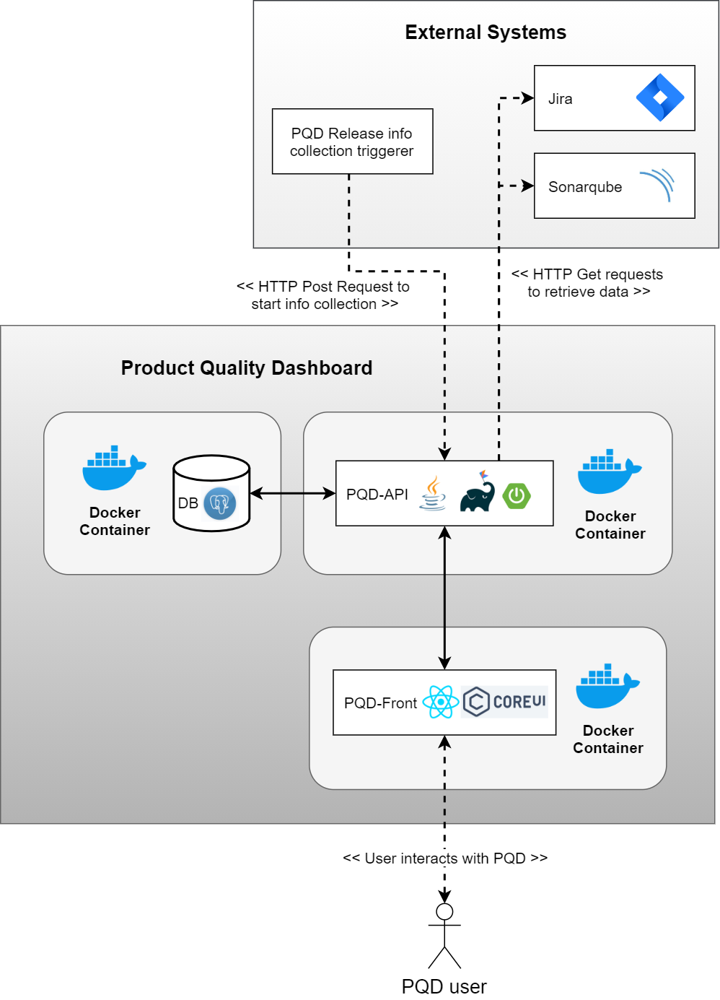
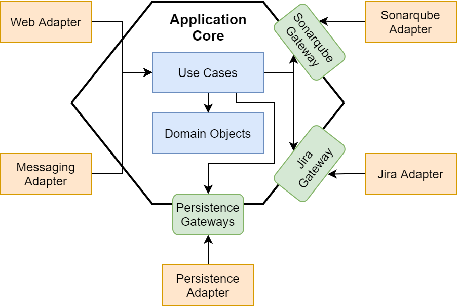

# Product Quality Dashboard

### Intro
The PQD stands for Product Quality Dashboard, which is a system that I implemented during my master thesis at the
University of Tartu (Software Engineering curriculum).
In short, the idea is to read data from different static
analysis tools and visualize them all together in a dashboard to provide easier overview of the software product quality
metrics, extracted from various sources.
In addition, the system provides a quality level between 0 and 1 (or 0 - 100%) to
make it easier to track the changes of quality through time. 

The PQD is a system that collects data from tools, such as SonarQube and Jira, calculates software quality level, and displays the data into a dashboard. The PQD is meant to provide straightforward overview of quality, and it is built with future extension kept in mind.

The PQD system is made of three components: PQD-API, PQD-Front, and PQD-DB. PQD-API is the main component of the system. The PQD-API is implemented using Hexagonal architecture. PQD-Front is the user interface of the system. PQD-DB is the database of the system, that is used by the PQD-API.

PQD-API and PQD-DB files are included in this repository.
PQD-Front is included in [here.](https://github.com/Kert944/PQD-Front-React)

The **high-level architecture** of the current version of PQD is the following:




### Deploy to web
The PQD can be run on a local machine with no containers for development activities. However, **to deploy the PQD to a web instance**, such as AWS EC2, there are some simple steps you would have to follow:

1. Create AWS EC2 instance, install Docker, and docker-compose (more information can be read from [here](https://medium.com/@umairnadeem/deploy-to-aws-using-docker-compose-simple-210d71f43e67)). Follow the steps:
1.1. Create AWS EC2 Linux instance (doesn't have to be AWS, its just an example I used)
1.2. Install Docker and docker-compose
~~~~
sudo yum update
sudo yum install docker
sudo curl -L https://github.com/docker/compose/releases/download/1.29.1/docker-compose-`uname -s`-`uname -m` | sudo tee /usr/local/bin/docker-compose > /dev/null
sudo chmod +x /usr/local/bin/docker-compose
sudo ln -s /usr/local/bin/docker-compose /usr/bin/docker-compose
~~~~
2. Download and unpack PQD-API and PQD-Front in your home directory:
~~~~
sudo wget -c https://github.com/Kert944/PQD-BE/archive/5.tar.gz | sudo tar -xz
sudo tar xzvf  5.tar.gz 
sudo rm 5.tar.gz
~~~~

~~~~
sudo wget -c https://github.com/Kert944/PQD-Front-React/archive/9.tar.gz | sudo tar -xz
sudo tar xzvf  9.tar.gz 
sudo rm 9.tar.gz
~~~~
3. Start Docker
~~~~
sudo service docker start
~~~~
4. Start PQD-API container in the PQD-API directory
~~~~
sudo docker-compose -f pqd-be.yml up --build -d
(to bring down: sudo docker-compose -f pqd-be.yml down)
~~~~
5. Stat PQD-Front container in the PQD-Front directory
~~~~
sudo docker-compose up -d --build
(to bring down: sudo docker-compose down)
~~~~
6. Check that the containers are up and running the application
~~~~
sudo docker container ps 
sudo docker ps -a
sudo docker container logs <container_id> 
~~~~
7. Access your application from port 3000
~~~~
<url_to_your_instance>:3000/#/login
~~~~

# PQD-API

Here you can read about the business use case of the PQD-API, how it was built and what to keep in mind while
implementing additional functionality.

## Technical description
The project is written using characteristics of hexagonal architecture (aka ports and adapters pattern) and domain 
driven design. The components are separated by gradle modules.



At the center lies the core business logic, that doesn't know anything about the other modules.
It doesn't care where the data is coming or where it is going. The core business logic is implemented by use
cases instead of service classes. Basically, the methods that would typically be in the service classes are now each
a separate class with one concrete purpose. The use cases are executed with a request wrapper, and they respond with a
response wrapper. The gateway of an outgoing exposed port is omitted for executing the use cases,
because it does not improve the layer division. The use cases can be imported and executed in the adapters while keeping the
desired separation between layers. However, if the use cases need something from anywhere external of the core, they
ask it from a gateway of input interface that is implemented by some adapter.

The adapters implement the core layer, but do not see each other. This means that while both adapters A and B can
access resources from the application core, they cannot access each other. Each layer must map the data into the
layer objects, even if it means code duplication. For example, if core defines ReleaseInfo, then web adapter
maps it into ReleaseInfoResultJson, and persistence adapter maps it into ReleaseInfoEntity.

Security is provided by adapters. Web adapter is responsible for creating and reading jwt, that contains claims for 
user products. If user tries to access product that is not claimed in the jwt, then the adapter responds with a status 
unauthorized. Messaging adapter uses weaker security with a token that is generated by the core layer. The purpose 
is to put the token in the header of the triggering request, to reduce the risk of unauthorized request, while 
keeping the user password safe. This token doesn't expire, but can be replaced.

Keep in mind not to change the layer dependencies between each other, while developing new functionality. Adapters
cannot access or implement each other. They can only access the core layer. Keep writing unit tests to each adapter
and to the core module. Integration tests are written in the configuration module using MockMvc and Testcontainers. 
You can find the description, of how to add a support for an additional tool, below.

### Directory structure:
```
adapters/          adapters for implementing outside communication (with unit tests)
    messaging/     rest api (one endpoint) for triggering release info collection, responsible for security
    persistence/   adapter for database connection (stores data)
    sonarqube/     adapter for sonarqube api connection (asks data)
    jira/          adapter for jira api connection (asks data)
    web/           rest api for web communication, responsible for security 
application/       core business logic (with unit tests)
configuration/     spring boot module and all configurations, builds docker image (with integration tests)
dev-scripts/       script to set up db 
```


# Running Locally

To clone the project:

```
git clone git@github.com:Kert944/PQD-BE.git 
```

### Development environment setup
* JDK11 and set JAVA_HOME
* Docker (enable **Expose daemon on tcp...** from settings)
* IDEA plugins: Lombok
* Enable -> File | Settings | Build, Execution, Deployment | Compiler | Annotation Processors

### Starting the API
* Run **PostgreSQL** in a Docker container
    * docker-compose file is provided to launch postgreSQL:
        * Can be either ran by right clicking on the manifest by 'Run ...'
        * Using command line (at the project root directory):
    
            * To run container:

                ```
                docker-compose -f dev-scripts/docker/postgresql.yml up -d
                ```

            * To kill container:
                ```
                docker-compose -f dev-scripts/docker/postgresql.yml down
                ```
* Run the **API** 
    * from configuration/src/main/java/com/pqd/BackendApplication.java
* _Optional_: Run **Sonarqube** locally to test release info collection:
    * https://docs.sonarqube.org/latest/setup/get-started-2-minutes/ (I used the zip file)
        * Follow the instructions on the Sonarqube webpage to install and analyze a (java) project
            * Use component name (project key) _ESI-builtit_ so that you can trigger release info collection with the 
              test user 
              that is already inserted into the DB
              

Containerize and run the app in Docker:
* Run gradle clean and gradle build to get the last state of the app
* At the root folder, run the following command:

     ```
     docker-compose -f pqd-be.yml up --build -d
     ```
* To kill the containerz, run:
    ```
     docker-compose -f pqd-be.yml down
    ```

### Database changelog
Flyway is used for database changelog. Migration files are located at:
`configuration/src/main/resources/db/migration`

_Not so relevant, if not deployed to production_: New change sets must be in order and prefixed with
```V<timestamp>__changename.sql```
Change sets that should run on every migration should be prefixed with ```R__changename.sql```   

# Using the API
API Swagger (majority of requests need authorization with Bearer token, jwt)
```
http://localhost:8080/swagger-ui/index.html#/
```
Triggering release info collection (needs PQD API token): 
```
http://localhost:8080/api/messaging/trigger?productId=<product_id>
```
* Release info collection can be started with post request (url above) to messaging controller
* The endpoint requires basic authentication with token: 
    * In Postman, simply put the token to the username field and postman does the rest
    * If sending manually, then
        * Add colon ':' to the end of the token
        * Encrypt the token to Base64 
          * Javascript encrypting example: btoa("<your_product_token>:"))
        * Add the encrypted token to authorization header
          * add word "Basic" before the token
            * example: "Basic ODI1N2N..."
* The endpoint triggers asynchronous data collection, meaning that you get status 200 if the request passes the 
  controller - it doesn't indicate that the collection was successful (this runs on a different thread)

# Adding support for a another tool
* Add DB support for the new tool 
    * create table public.<tool_name>\_info with necessary columns
    * add reference public.<tool_name>\_info(id) to table public.product
    * create table public.release_info_<tool_name> with necessary columns
    * add reference public.release_info_<tool_name>(id) to table public.release_info
    * _optional_: add sample data to the db
    
* Add another adapter module for connecting with the tool
    * alternatively, add a module to connect to the building environment or pipeline if the data could be read from 
      there
      
* Implement _Retrieve<new\_tool>Data_ use case, so that when executing the use case, data from the new product is 
  retrieved
    * you can take _RetrieveSonarqubeData_ use case as an example

* Add support for the new tool in the domain objects, product use cases and release use cases

* Add the _Retrieve<new\_tool>Data_ to the _CollectAndSaveAllReleaseData_ so that on a trigger, from a messaging 
  adapter, data from all the supported tools are collected
    * At this point think on the case if the user does not have one of the tools connected to his/her product
        * should perform a check if the given product has support for the tool (don't want to start data collection 
          if there is no tool to collect from)
          
* Improve _SaveReleaseInfo_ and _CalculateQualityLevel_
    * think about what to do when the product doesn't have the support for all the tools
    
* Implement and improve other relevant parts and do not forget testing

# Statistics 
Last updated 28.01.2021

## Tests
**35 integration** tests

**104 unit** tests in total
* application - 27 unit tests
* adapters - 77 unit tests:
  * jira - 8 unit tests
  * messaging - 6 unit tests
  * persistence - 20 unit tests
  * sonarqube - 7 unit tests
  * web - 36 unit tests

**JaCoCo** report with everything included except test modules (everything related to testing excluded from the 
report), created on 28. Jan 2021:

| Module                | Class % | Method % | Line % | 
| --------------------- | ------------- | ------ | ---- | 
| application           | 89% (79/88)   | 76% (206/270) | 81% (324/400) | 
| adapters.web          | 84% (49/58)   | 67% (186/274)	| 71% (403/560) | 
| adapters.sonarqube    | 87% (7/8)     | 40% (12/30)	| 71% (53/74)	| 
| adapters.persistence  | 71% (23/32)   | 85% (117/137)	| 91% (308/337) | 
| adapters.messaging    | 33% (1/3)     | 50% (4/8)	    | 63% (19/30)	| 
| adapters.jira         | 100% (9/9)    | 70% (35/50)	| 85% (103/121)	|
| **Weighted average**  | **84.85% (168/198)**    | **72.82% (560/769)**    | **79.50% (1210/1522)**    | 

*Calculation error

## Code 
Created 28. Jan 2021

All files included:

| Extension | Files | Size SUM (kb) | Size MIN (kb) | Size MAX (kb) | Size AVG (kb) | Lines | Lines MIN | Lines MAX | Lines AVG | Lines CODE |
| ----- | ------ | ------ | ----- | ----- | ------ | ------ | ----- | ----- | ------ | ------ |
| java	| 161 | 	377 | 0 |  29  | 	2 | 	9081 |	4 |	525 |	56 |	7317 |

Testing related files excluded:

| Extension | Files | Size SUM (kb) | Size MIN (kb) | Size MAX (kb) | Size AVG (kb) | Lines | Lines MIN | Lines MAX | Lines AVG | Lines CODE |
| ----- | ------ | ------ | ----- | ----- | ------ | ------ | ----- | ----- | ------ | ------ |
| java	| 112 | 	150 | 0 |  10  | 	1 | 	4276 |	4 |	233 |	38 |	3321 |
